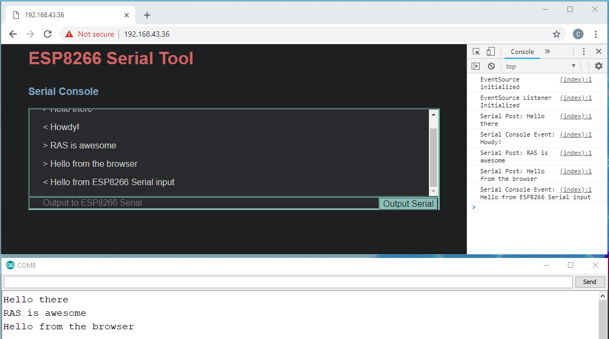

# ESP8266_Arduino_Examples
Some example sketches for the ESP8266 using the ESP8266WiFi library for Arduino, UT Austin R.A.S. Demobots Committee. These examples should also mostly compile for the ESP32 with the ESP32-Arduino core if you remove the word "ESP8266" from the included header files and class names.  
 
https://arduino-esp8266.readthedocs.io/en/latest/esp8266wifi/readme.html 

## ESP8266-01 Connection Guide
 * VCC: 3.3V
 * GND: GND
 * CH_PD: 3.3V via 10k resistor
 * RST: 3.3V via 10k resistor, or float, or to a GPIO pin if you want to reset
 * RX (GPIO3) and TX (GPIO1): any UART RX and TX pins, depends on the microcontroller
     * TI TM4C LaunchPad: UART1 RX -> PB1, TX -> PB0, set up and read from UART 1
 * To flash, before booting connect
   * GPIO0 to ground
   * GPIO2 to 3.3V or float (there is an internal pull up)
 * To run, before booting connect
   * GPIO0 to 3.3V or float
   * GPIO2 to 3.3V or float
 * GPIO0, GPIO2, and GPIO1 are all busy during boot, but are free to be used as GPIO afterwards
   * RX (GPIO3) can be connected to a servo on boot, but TX (GPIO1) can only be connected after boot

## ESPWiFiSerialTool
Simple WiFi Serial tool. Can be configured to connect to a WiFi network or broadcast its own Access Point. It also creates a web server with a Javascript console, which can output data and receive input to the ESP8266 Serial pins. The Serial output operates through an AJAX POST form. The live updates on Serial input are sent through a Server-Sent HTTP event stream. This project is meant to be added onto existing RAS projects that accept serial input (like the LED sign board) so we can wirelessly run demos from any phone or computer. Uses the ESP8266WebServer library.

## WebServerExample
Attempting to set up an example web server implementation using the streams in the Arduino WebServer class in the ESP8266WiFi library. The goal is to handle multiple clients, work in progress.

## TimeSyncExample
Example of how to time sync the ESP8266 and generate strings from the time functions in clock.h. Synchronize time with the internet and then use c standard library functions to get the current time.

## ESPSseServer
Example of maintaining a HTTP event-stream of Server-Sent Events with ESP8266WebServer. Need to do another example with a different web server because this implementation is not meant to persist connections with clients for a long time, but it works with Javascript EventSource and listeners that will reconnect.

## ESPHttpNode
Examples of various HTTP client requests that a device can make to other servers, such as GET, POST, and listening to Server-Sent Event streams. Function sseListen models a Javascript EventSource, but it's not fully standard compliant.
