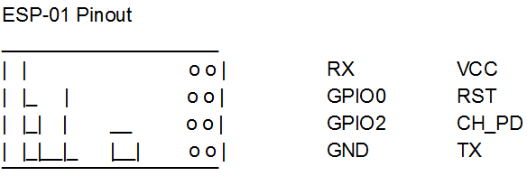
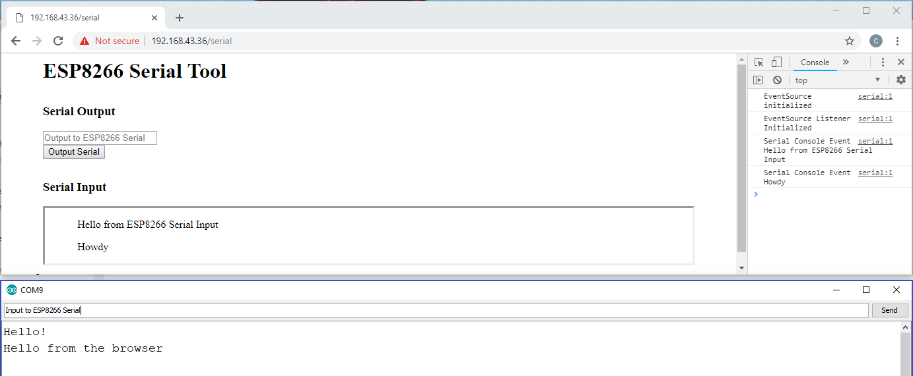

# ESP8266_Arduino_Examples
Some example sketches for the ESP8266 using the ESP8266WiFi library for Arduino, UT Austin R.A.S. Demobots Committee 
 
https://arduino-esp8266.readthedocs.io/en/latest/esp8266wifi/readme.html 

## ESP8266-01 Connection Guide
 * VCC: 3.3V
 * GND: GND,
 * CH_PD: 3.3V via 10k resistor
 * RST: 3.3V via 10k resistor, or to a GPIO pin if you want to reset
 * RX and TX: any UART RX and TX pins, depends on the microcontroller
     * TI TM4C LaunchPad: UART1 RX -> PB1, TX -> PB0, set up and read from UART 1
 * To flash, connect GPIO0 to ground before connecting to power

## ESPWiFiSerialTool
Simple WiFi Serial tool. Can be configured to connect to a WiFi network or broadcast its own Access Point. It also creates a web server with a simple Serial output HTML form. The form text is output over the ESP8266 Serial pins. There is also a Javascript console, which receives Server-Sent HTTP event stream updates when the ESP8266 receives Serial inputs. Working towards a fully functional Serial console. This project is meant to be added onto existing RAS projects that accept serial input (like the LED sign board) so we can easily run demos from any phone or computer. Uses the ESP8266WebServer library.

## WebServerExample
Attempting to set up an example web server implementation using the streams in the Arduino WebServer class in the ESP8266WiFi library. The goal is to handle multiple clients, work in progress.

## TimeSyncExample
Example of how to time sync the ESP8266 and generate strings from the time functions in clock.h. Synchronize time with the internet and then use c standard library functions to get the current time.
