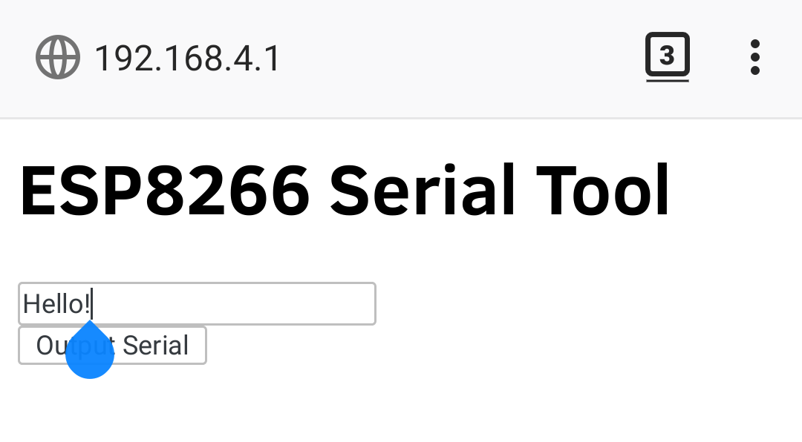

# ESP8266_Arduino_Examples
Some example sketches for the ESP8266 using the ESP8266WiFi library for Arduino, UT Austin R.A.S. Demobots Committee 
 
https://arduino-esp8266.readthedocs.io/en/latest/esp8266wifi/readme.html 

## ESPWiFiSerialTool
Simple WiFi Serial tool. Can be configured to connect to a WiFi network or broadcast its own Access Point. It also creates a web server with a simple HTML form. The text input is output over the ESP8266 Serial pins. This project is meant to be added onto existing RAS projects that accept serial input (like the sign board). Uses the ESP8266WebServer library.

## WebServerExample
Attempting to set up an example web server implementation using the streams in the Arduino WebServer class in the ESP8266WiFi library. The goal is to handle multiple clients, work in progress.
